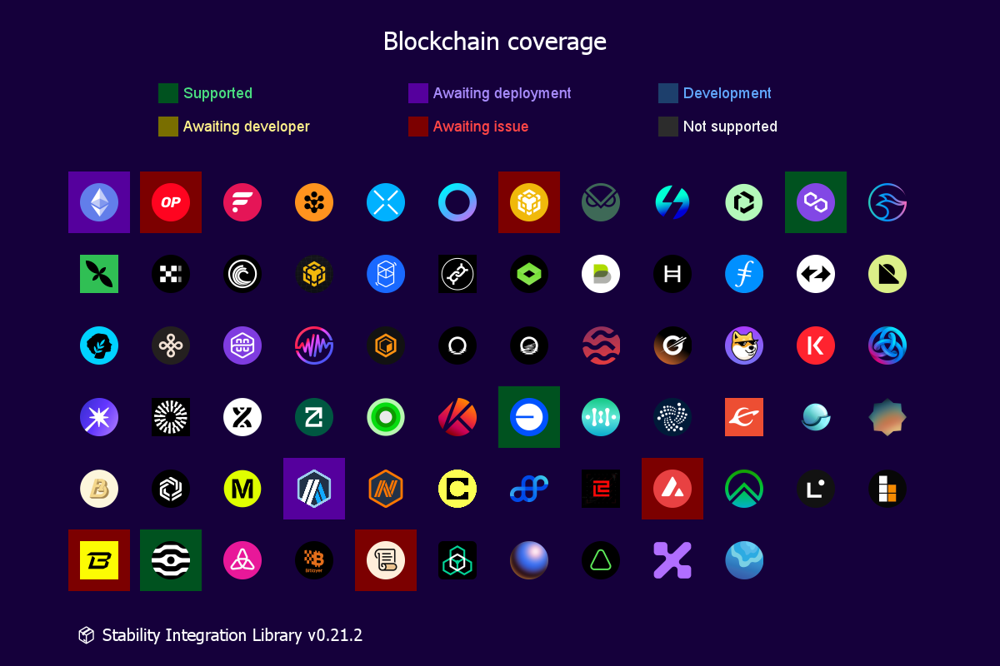

# 📦 Stability Integration Library


[](https://codecov.io/github/stabilitydao/stability)

This is library for integrating Stability Platform into Node.js applications.



## 🔌 Usage

Add npm package to your js/ts project:

```shell
yarn add @stabilitydao/stability
```

### 📡 API

Up-to-date and pre-processed data for integrations with Stability can be obtained in a single API response, which is always available at any working node of the private p2p network Stability. This library contains addresses of seed nodes.

```typescript
import axios from "axios";
import { type ApiMainReply, seeds } from "@stabilitydao/stability";

const response = await axios.get(seeds[0]);
const apiReply = response.data as ApiMainReply;
```

### 💲 Strategies

Comprehensive information about platform strategies for managing DeFi assets. Includes developed strategies and those currently in development or awaiting development.

#### Types

- `Strategy`

#### Enums

- `const enum StrategyShortId`
- `enum StrategyState`
- `enum BaseStrategy`

#### Constants

- `strategies: {[shortId in StrategyShortId]:Strategy}`
- `strategyStateDescription: {[state in StrategyState]: string}`
- `baseStrategyContracts: {[baseStrategy in BaseStrategy]: string}`

#### Methods

- `getMerklStrategies()`
- `getStrategyShortId(id: string): StrategyShortId|undefined`
- `getStrategiesTotals(): {[state in StrategyState]: number}`
- `getStrategyProtocols(shortId: StrategyShortId): DeFiProtocol[]`
- `getChainStrategies(chainName: ChainName): Strategy[]`

### #️⃣ Deployments

Core contracts deployment addresses and subgraph API endpoints.

```typescript
import { deployments } from "@stabilitydao/stability";
console.log("Platform address on Polygon", deployments["137"].core.platform);
```

#### Types

- `Deployment`

#### Constants

- `deployments: {[chainId:string]:Deployment}`

### ⛓️ Chains

Blockchains known to the platform and their integration statuses. Each chain has link to image in [stabilitydao/.github](https://github.com/stabilitydao/.github) repo [`chains/` folder](https://github.com/stabilitydao/.github/tree/main/chains).

#### Types

- `Chain`
- `ChainStatusInfo`

#### Enums

- `const enum ChainName`
- `const enum ChainStatus`

#### Constants

- `chains: { [chainId: string]: Chain }`
- `chainStatusInfo: {[status in ChainStatus]: ChainStatusInfo}`

#### Methods

- `getSupportedChainNames(): ChainName[]`
- `getChainsTotals(): {[status in ChainStatus]: number}`
- `getChainByName(chainName: ChainName): Chain`

### 🌐 Integrations

DeFi organizations, protocols, their integration statuses, usage and other information. Each organization has link to image in [stabilitydao/.github](https://github.com/stabilitydao/.github) repo [`assets/` folder](https://github.com/stabilitydao/.github/tree/main/assets).

#### Types

- `DeFiOrganization`
- `DeFiProtocol`

#### Enums

- `const enum IntegrationStatus`
- `enum DefiCategory`

#### Constants

- `integrations: { [org: string]: DeFiOrganization }`

#### Methods

- `getIntegrationStatus(p: DeFiProtocol): IntegrationStatus`
- `getChainProtocols(chainId: string): DeFiProtocol[]`

### 📌 Addresses

Third-party addresses.

```typescript
import { almFactories } from "@stabilitydao/stability";
```

### 🪙 Assets

Asset addresses, description, website, color.

#### Types

- `Asset`

#### Constants

- `assets: Asset[]`

#### Methods

- `getAsset(chainId: string, tokenAddress: 0x${string}): Asset|undefined`

### 📜 Tokenlist

```typescript
import { tokenlist } from "@stabilitydao/stability";
```

### 🌉 Bridges

#### Types

- `Bridge`

#### Enums

- `const enum BridgeName`

#### Constants

- `bridges: Bridge[]`

#### Methods

- `getChainBridges(chainName: ChainName): Bridge[]`

### 🏆 Contests

#### Types

- `YieldContest`
- `Reward`

#### Constants

- `contests: { [contestId: string]: YieldContest }`

#### Enums

- `enum RewardType`

## 👷 Develop

```shell
yarn overview
yarn overview-full
yarn draw-chains
yarn draw-integrations
yarn contests-maker
yarn test
yarn coverage
yarn prettier . --check
yarn prettier . --write
```
