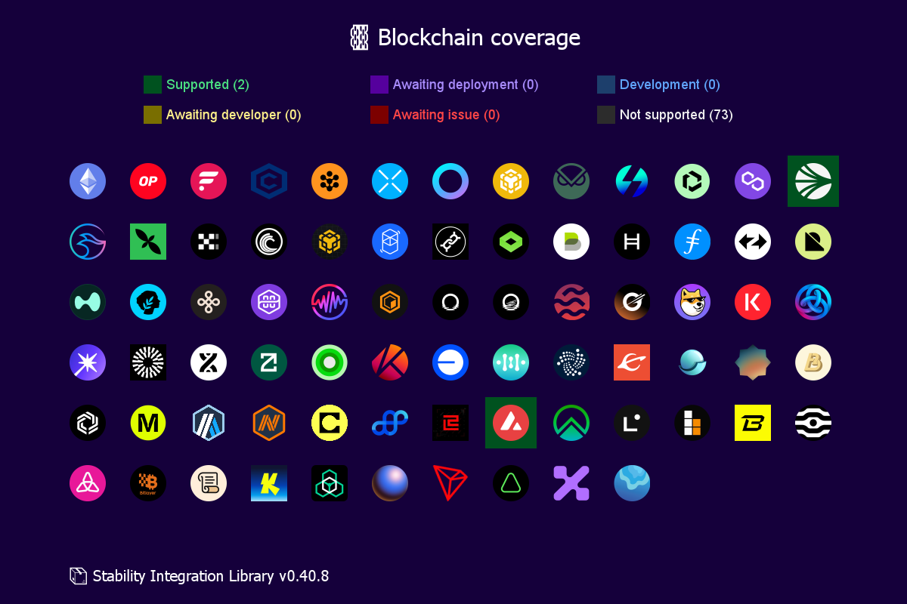
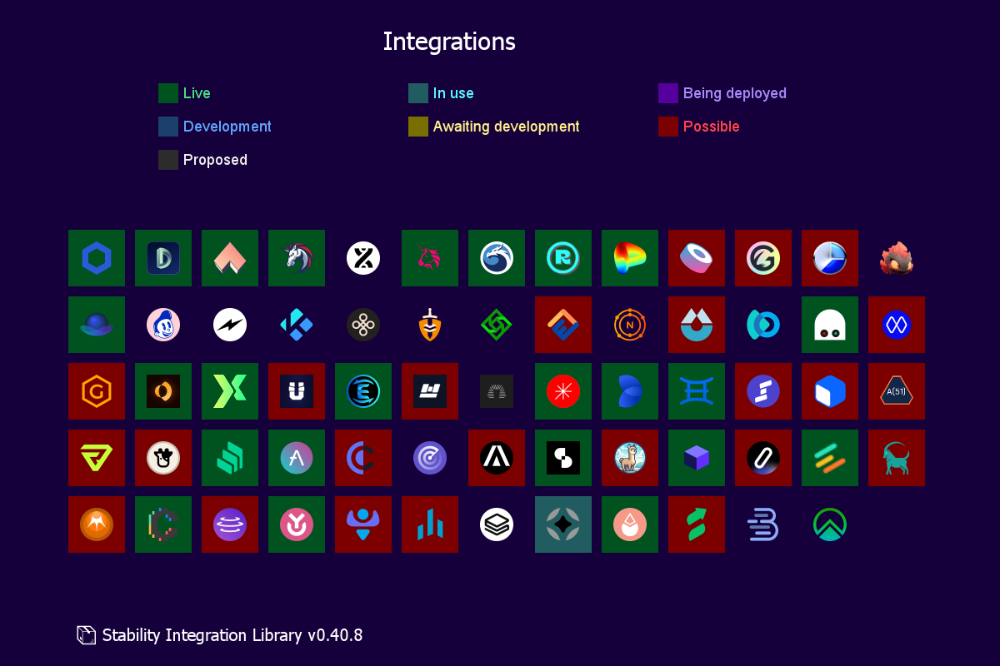

# 📦 Stability Integration Library


[](https://codecov.io/github/stabilitydao/stability)

This is library for integrating Stability Platform into Node.js applications.




## 🔌 Usage

Add npm package to your js/ts project:

```shell
yarn add @stabilitydao/stability
```

## 👷 Develop

### How to

```shell
yarn overview
yarn overview-full
yarn draw-chains
yarn draw-integrations
yarn contests-maker
yarn test
yarn coverage
yarn prettier . --check
yarn prettier . --write
```

### Branch structure

| Branch        | Description                            |
| ------------- | -------------------------------------- |
| main          | Production. Accepts only PRs from dev. |
| dev           | Accumulator of changes for the release |
| developer-dev | Developer's changes                    |

### Commit/PR prefix

| Changes            | Prefix |
|--------------------| ------ |
| API types          | 📡     |
| AI, Agents         | 🤖     |
| Strategies         | 💲     |
| Deployments        | #️⃣     |
| Chains             | ⛓️     |
| Integrations       | 🌐     |
| Assets, tokenlist  | 🪙     |
| Sync state, etc    | ♻️️    |
| Content generators | 🎇     |
| Bridges            | 🌉     |
| Risk               | 🚦     |
| Prettier           | #️⃣     |
| Docs               | 📙     |
| Adapters           | 🔌     |
| Contests           | 🏆     |
| Lending            | 🏦     |
| Collector          | 📦     |
